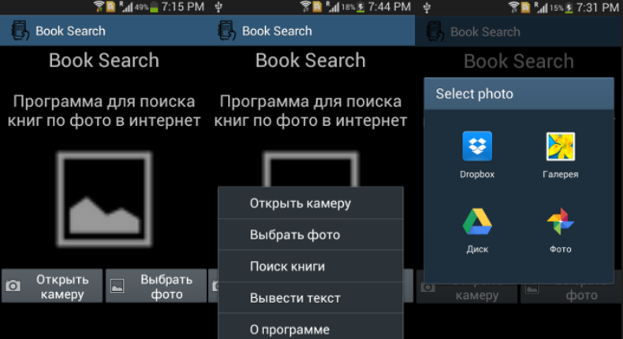
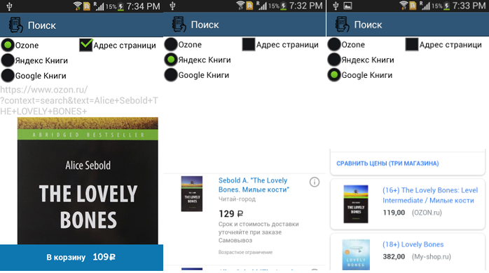

# BookSearch

<p align="center">
    <a href="C#"></a>
	<a href="Xamarin"></a>
</p>

BookSearch - это дипломный проект, на тему "Разработка мобильного приложения по распознаванию книг и поиск их в интернете" (2018 г.).

Проект реализован на платформе Xamarin с использованием языка программирования C#. 
В качестве API компьютерного зрения было выбран Microsoft Cognitive Vision API.

# Скриншоты
<p align="center">
    
</p>

<p align="center">
    
</p>

## Запуск приложения
*подробная инструкция по установке visual studio доступна на сайте [xamarin](https://developer.xamarin.com/guides/cross-platform/getting_started/installation/windows/)*

* Установить [visual studio](https://www.visualstudio.com/vs/whatsnew/) или [visual studio for mac](https://www.visualstudio.com/vs/visual-studio-mac/) в любой из редакций
* Выбрать **Мобильная разработка с .Net (Mobile development with .NET)** из рабочих сценариев при установке

* Клонируйте репозиторий
 ```bash
git clone https://github.com/EgorTolbaev/BookSearch.git
```
* Открыть `BookSearch.sln`
* Установить `Android SDK level 16` (Android 4.1) или выше, но при этом может потребоваться изменения конфигурации, с помощью sdk manager 
* Собрать проект — `Build` -> `Build solution` (`Ctrl+Shift+B`)
* Запустить (либо на эмуляторе, либо на реальном устройстве). Для запуска на iOS необходим Macintosh, Android можно запускать на любой системе. Инструкции по запуске на [Android](https://developer.xamarin.com/guides/android/getting_started/installation/windows/#Android_Emulator), [iOS](https://developer.xamarin.com/guides/ios/getting_started/installation/)